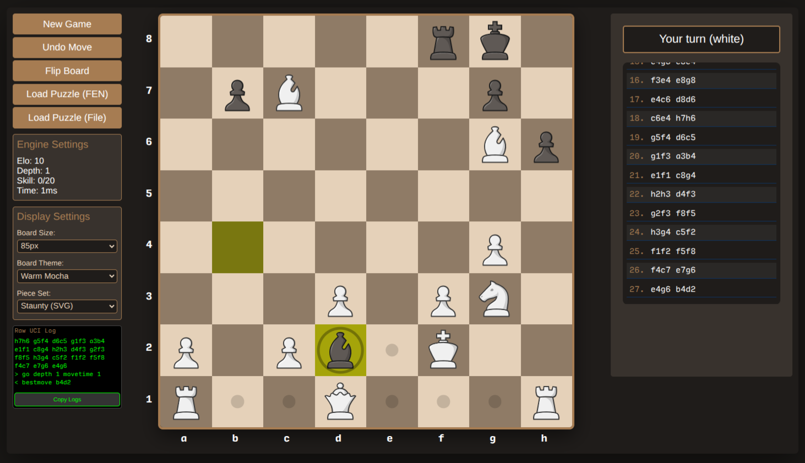

# web-chess
Web chess with python server, stockfish engine and html frontend  
  
### The chess engine
#### Clone the `stockfish` chess engine
```sh
git clone https://github.com/official-stockfish/Stockfish
cd Stockfish
```
#### Adjust the difficulty settings
```sh
grep -nR --include=\*.{cpp,h} -e "LimitStrength" \
  -e "UCI_LimitStrength" -e "Elo" -e "Skill Level" . 
sed -i 's/constexpr static int LowestElo  = 1320;/\
  constexpr static int LowestElo  = 1;/' src/search.h
sed -i 's/options.add("Skill Level", Option(20, 0, 20));/\
  options.add("Skill Level", Option(1, 0, 20));/' src/engine.cpp
sed -i 's/options.add("UCI_LimitStrength", Option(false));/\
  options.add("UCI_LimitStrength", Option(true));/' src/engine.cpp
grep -nR --include=\*.{cpp,h} -e "LimitStrength" \
  -e "UCI_LimitStrength" -e "Elo" -e "Skill Level" . 
```
#### Compile and install the binary
```sh
make -C src build ARCH=x86-64 -j$(nproc)
sudo make -C src install
```
### The client/server side
#### The python web server - start it
```sh
python3 chess_server.py
```
#### The client - connect
Use a web browser to connect to the URL
```
http://localhost:5000
```
